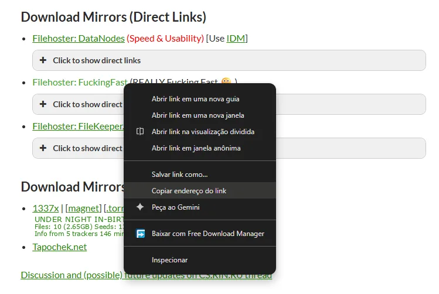
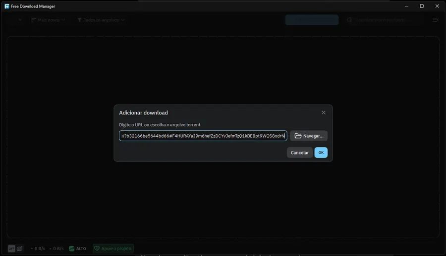
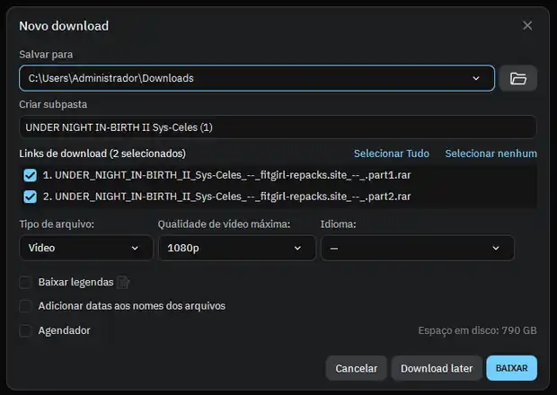
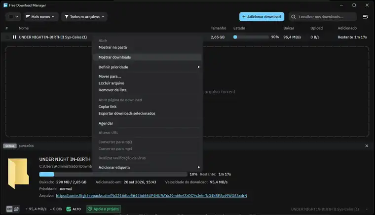
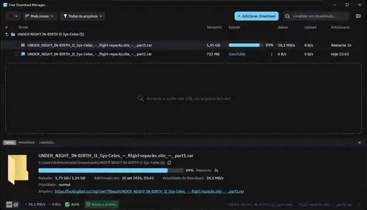

# FTGirl DDL FDM

**FTGirl DDL FDM** is a Free Download Manager add-on that turns the **FuckingFast direct-link mirror** from FitGirl release pages into a selectable download list inside FDM.

> Current version: **1.1.0**  
> Language: **English** · [Português (Brasil)](README.pt-BR.md)

## What it does

When you copy the **Filehoster: FuckingFast** mirror link from a FitGirl release page, that link normally points to a `paste.fitgirl-repacks.site` PrivateBin page containing several FuckingFast file URLs.

FTGirl DDL FDM handles the flow for you:

1. FDM receives the FitGirl/FuckingFast mirror link.
2. The add-on downloads the encrypted PrivateBin payload.
3. The payload is decrypted locally.
4. All FuckingFast file pages are extracted and shown as a selectable list in FDM.
5. When a selected file actually starts, its FuckingFast page is resolved to the direct download URL.
6. FDM downloads each file normally and shows every part individually under **Show downloads**.

The direct URL is resolved only when each selected file starts, which helps avoid signed links expiring before FDM begins the transfer.

## Supported links

- `https://paste.fitgirl-repacks.site/...#...`
- FitGirl release pages on `https://fitgirl-repacks.site/...`
- Individual `https://fuckingfast.co/...` file pages

## Requirements

- Free Download Manager with add-on support.
- Python **3.11+**. FDM may offer to install the declared Python dependency automatically. Python 3.11+ matches the upstream fitgirl-ddl-ng 0.4.12 requirement.
- Internet access on the first run so the Python bridge can install its required packages.
- Chrome, Chromium, Edge or Brave is only needed for the browser fallback path.

## Install the FDM extension

1. Download `FTGirl-DDL-FDM-v1.1.0.fda` from the project release.
2. Open **Free Download Manager**.
3. Open the FDM menu and go to **Add-ons**.
4. Choose **Install add-on from file...**.
5. Select `FTGirl-DDL-FDM-v1.1.0.fda`.
6. Allow the `launchPython` permission when FDM asks for it.
7. If FDM offers to install Python, allow it.
8. Restart FDM after installation.

The internal add-on UUID is intentionally kept as `fitgirl-ddl-ng-fdm` so users of the earlier development builds can upgrade without installing a duplicate add-on.

## How to use

### 1. Copy the FuckingFast mirror link

On the FitGirl release page, find **Download Mirrors (Direct Links)**. Right-click **Filehoster: FuckingFast** and choose **Copy link address**.



The copied URL usually looks like this:

```text
https://paste.fitgirl-repacks.site/?xxxxxxxxxxxxxxxx#xxxxxxxxxxxxxxxxxxxxxxxxxxxxxxxxxxxxxxxxxxxx
```

### 2. Add the link to FDM

Open Free Download Manager, click **Add download**, paste the copied URL and press **OK**.



### 3. Select the files

FTGirl DDL FDM will expand the mirror into the available parts. Select all files or only the parts you want and click **DOWNLOAD**.



### 4. Show the individual downloads

FDM initially groups the selected parts under one download entry. Right-click that entry and choose **Show downloads**.



Each selected `.rar` part is then displayed separately and downloaded through its resolved FuckingFast URL.



## First-run behavior

The Python bridge installs its runtime dependencies into a temporary user directory on the first run. They are reused on later runs.

For normal `paste.fitgirl-repacks.site` links, PrivateBin decryption is performed locally and does not require opening a browser. A visible Chromium-based browser is kept only as a fallback for cases where the HTTP route cannot resolve a supported page.

FTGirl DDL FDM does **not** include an automatic CAPTCHA/Turnstile bypass service. If a site requires a legitimate interactive browser verification in a fallback flow, complete it manually.

## How the add-on is structured

```text
plugin/
├── manifest.json       FDM add-on manifest
├── common.js           Shared FDM/JavaScript helpers
├── parser.js           FitGirl/PrivateBin playlist parser
├── msparser.js         Per-file FuckingFast resolver
├── icon.svg            Add-on icon
└── python/
    └── fdm_bridge.py   PrivateBin + FuckingFast backend bridge

build/
├── build.ps1
├── build.bat
└── build.sh
```

The `.fda` file is a ZIP-compatible archive with `manifest.json` at the root of the package.

## Build from source

### Windows / PowerShell

```powershell
./build/build.ps1
```

### Windows / CMD

```bat
build\build.bat
```

### Linux / macOS

```bash
bash build/build.sh
```

The build produces:

```text
FTGirl-DDL-FDM-v1.1.0.fda
```

## Release files

A stable release contains:

- `FTGirl-DDL-FDM-v1.1.0.fda` — installable Free Download Manager extension.
- `FTGirl-DDL-FDM-v1.1.0-source.zip` — complete project source for the same version.

## Upstream compatibility (v1.1.0)

- This FDM adaptation tracks **fitgirl-ddl-ng v0.4.12** (released October 2, 2026) at [upstream commit `7fc99c35`](https://github.com/mokurin000/fitgirl-ddl-ng/commit/7fc99c35e37cceb964cf7f6b50df6f0519db12e2).
- The Python bridge pins **Zendriver 0.17.1** and retains the upstream HTMX `POST /f/{id}/go` + `HX-Redirect` resolution contract.
- Five browser fetch attempts, exponential retry delays, updated FitGirl spoiler selectors, and HTTP-to-browser fallback address recent upstream changes.
- **FDM-specific behavior is preserved**: lists are discovered first and each selected page is resolved only when FDM requests that item.
- Upstream GUI, CLI, aria2 output, telemetry/Sentry and standalone installers are **not bundled** because this is an FDM extension, not a duplicate of the upstream application.
- Automated unit checks run on Python 3.11 and 3.12. Final real-world validation requires Windows/FDM and working supported hosts.
- Only use the add-on to download files you are authorized to obtain.

## Credits

The backend concept and original **fitgirl-ddl-ng** project were created by **[mokurin000](https://github.com/mokurin000)**:

- Upstream project: **[mokurin000/fitgirl-ddl-ng](https://github.com/mokurin000/fitgirl-ddl-ng)**

FTGirl DDL FDM adapts that work to the Free Download Manager add-on format and adds the FDM-specific playlist/parser integration, PrivateBin handling and per-file download flow.
