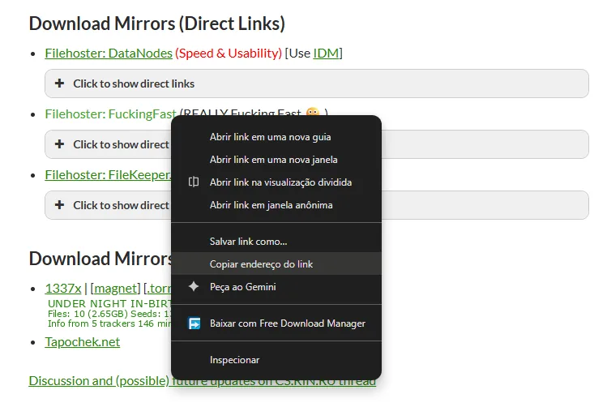
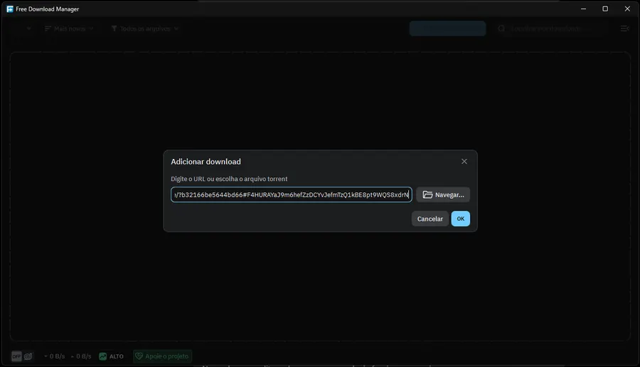
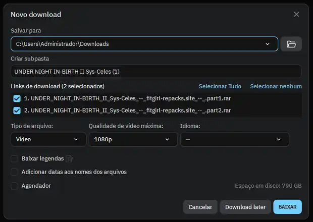
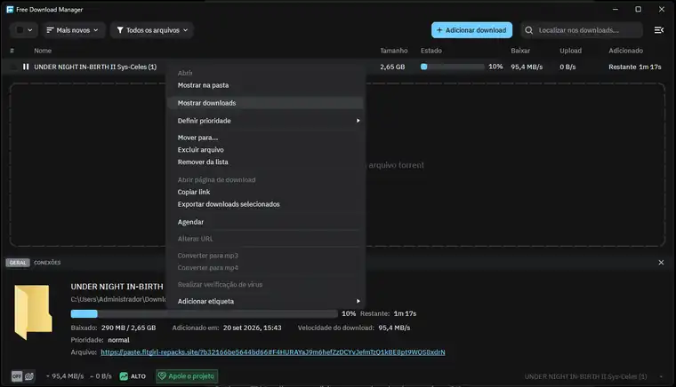
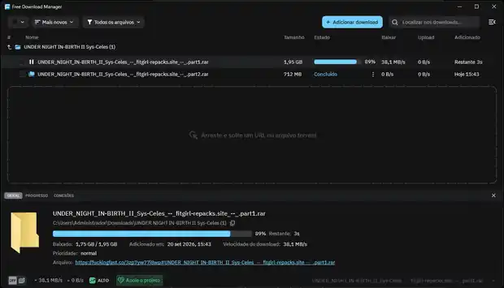

# FTGirl DDL FDM

**FTGirl DDL FDM** é uma extensão para o Free Download Manager que transforma o espelho de links diretos **FuckingFast** das páginas FitGirl em uma lista selecionável de arquivos dentro do FDM.

> Versão atual: **1.0.0**  
> Idioma: [English](README.md) · **Português (Brasil)**

## Como funciona

Ao copiar o link **Filehoster: FuckingFast** de uma página de lançamento FitGirl, normalmente você recebe um endereço `paste.fitgirl-repacks.site` do PrivateBin contendo vários links de arquivos do FuckingFast.

O FTGirl DDL FDM automatiza esse fluxo:

1. O FDM recebe o link do espelho FitGirl/FuckingFast.
2. A extensão baixa o conteúdo criptografado do PrivateBin.
3. O conteúdo é descriptografado localmente.
4. Todos os links de arquivos do FuckingFast são encontrados e exibidos em uma lista no FDM.
5. Quando um arquivo selecionado realmente começa a baixar, a página FuckingFast correspondente é resolvida para o link direto.
6. O FDM baixa cada arquivo normalmente e permite visualizar cada parte individualmente em **Mostrar downloads**.

O link direto é resolvido apenas quando cada arquivo inicia, evitando que links assinados expirem entre a seleção dos arquivos e o começo do download.

## Links suportados

- `https://paste.fitgirl-repacks.site/...#...`
- Páginas de lançamentos em `https://fitgirl-repacks.site/...`
- Páginas individuais `https://fuckingfast.co/...`

## Requisitos

- Free Download Manager com suporte a add-ons.
- Python **3.10+**. O próprio FDM pode oferecer a instalação da dependência Python declarada pela extensão.
- Internet na primeira execução para que o bridge Python instale os pacotes necessários.
- Chrome, Chromium, Edge ou Brave somente para o fluxo de fallback via navegador.

## Como instalar a extensão no Free Download Manager

1. Baixe `FTGirl-DDL-FDM-v1.0.0.fda` na Release do projeto.
2. Abra o **Free Download Manager**.
3. Abra o menu do FDM e acesse **Add-ons**.
4. Escolha **Install add-on from file...** / **Instalar add-on a partir de arquivo...**.
5. Selecione `FTGirl-DDL-FDM-v1.0.0.fda`.
6. Autorize a permissão `launchPython` quando o FDM solicitar.
7. Caso o FDM ofereça a instalação do Python, permita.
8. Reinicie o FDM após a instalação.

O UUID interno continua como `fitgirl-ddl-ng-fdm` para que usuários das versões de desenvolvimento anteriores possam atualizar a extensão sem instalar uma cópia duplicada.

## Guia de uso

### 1. Copie o link do provedor FuckingFast

Na página FitGirl, localize **Download Mirrors (Direct Links)**. Clique com o botão direito em **Filehoster: FuckingFast** e escolha **Copiar endereço do link**.



O endereço copiado normalmente tem este formato:

```text
https://paste.fitgirl-repacks.site/?xxxxxxxxxxxxxxxx#xxxxxxxxxxxxxxxxxxxxxxxxxxxxxxxxxxxxxxxxxxxx
```

### 2. Adicione o link ao FDM

Abra o Free Download Manager, clique em **Adicionar download**, cole o link e pressione **OK**.



### 3. Selecione os arquivos

A extensão irá expandir o espelho e mostrar as partes disponíveis. Selecione todos os arquivos ou somente os que desejar e clique em **BAIXAR**.



### 4. Pressione Mostrar downloads

Inicialmente o FDM agrupa os arquivos selecionados em uma entrada. Clique com o botão direito nessa entrada e escolha **Mostrar downloads**.



Os arquivos `.rar` serão exibidos separadamente, cada um baixando através do link FuckingFast resolvido pela extensão.



## Primeira execução

Na primeira execução, o bridge Python instala as dependências em uma pasta temporária do usuário. Nas próximas execuções elas são reutilizadas.

Para links normais de `paste.fitgirl-repacks.site`, a descriptografia do PrivateBin é feita localmente e não precisa abrir o navegador. Um navegador baseado em Chromium é utilizado apenas como fallback quando o caminho HTTP não consegue resolver uma página suportada.

O FTGirl DDL FDM **não** inclui serviço de bypass automático de CAPTCHA/Turnstile. Caso algum fallback exija uma verificação interativa legítima no navegador, conclua-a manualmente.

## Estrutura do projeto

```text
plugin/
├── manifest.json       Manifesto do add-on FDM
├── common.js           Funções compartilhadas em JavaScript
├── parser.js           Parser de playlist FitGirl/PrivateBin
├── msparser.js         Resolvedor individual do FuckingFast
├── icon.svg            Ícone da extensão
└── python/
    └── fdm_bridge.py   Backend PrivateBin + FuckingFast

build/
├── build.ps1
├── build.bat
└── build.sh
```

O arquivo `.fda` é um pacote compatível com ZIP, contendo `manifest.json` diretamente na raiz.

## Compilar a partir da source

### Windows / PowerShell

```powershell
./build/build.ps1
```

### Windows / CMD

```bat
build\build.bat
```

### Linux / macOS

```bash
bash build/build.sh
```

O build gera:

```text
FTGirl-DDL-FDM-v1.0.0.fda
```

## Arquivos da Release

A Release estável contém:

- `FTGirl-DDL-FDM-v1.0.0.fda` — extensão instalável no Free Download Manager.
- `FTGirl-DDL-FDM-v1.0.0-source.zip` — código-fonte completo da mesma versão.

## Créditos

O conceito do backend e o projeto original **fitgirl-ddl-ng** foram criados por **[mokurin000](https://github.com/mokurin000)**:

- Projeto original: **[mokurin000/fitgirl-ddl-ng](https://github.com/mokurin000/fitgirl-ddl-ng)**

O FTGirl DDL FDM adapta esse trabalho para o formato de add-on do Free Download Manager e adiciona a integração específica de playlist/parser do FDM, tratamento do PrivateBin e fluxo de download arquivo por arquivo.

## Licença

Este projeto é distribuído sob a licença MIT. Consulte [LICENSE](LICENSE). O aviso de copyright e a licença do projeto original são preservados.

## Aviso

Este é um projeto independente de compatibilidade e não possui afiliação, endosso ou manutenção oficial do Free Download Manager, FitGirl ou FuckingFast. Utilize somente para conteúdos que você tenha direito legal de baixar.
